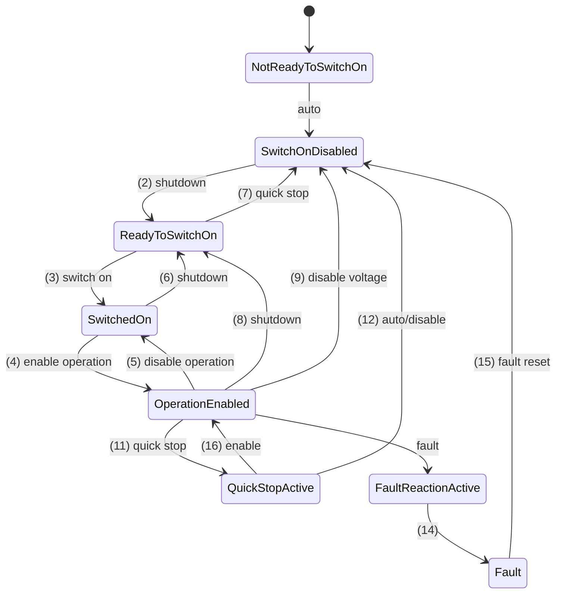

# Elmo Platinum — CiA 402 State Machine & Cyclic Modes

Source: `MAN-P-ADMINGUIDE.pdf` §4.2 (state machine), §4.9 (CSP), §4.10 (CSV),
§4.11 (CST). The state machine is the standard DS402 one already documented in
[../ethercat/07-cia402-drive-profile.md](../ethercat/07-cia402-drive-profile.md);
this file records the **Elmo-specific behavior** layered on top.

## 1. State machine (standard DS402, confirmed identical)

### Controlword (0x6040) command bits

| Bits used | Command | CW value (typical) |
|-----------|---------|--------------------|
| — | Shutdown | `0x0006` |
| — | Switch On | `0x0007` |
| — | Enable Operation | `0x000F` |
| bit 2 | Quick Stop | `0x0002` |
| bit 7 | Fault Reset | `0x0080` (rising edge) |
| bit 8 | **Halt** | behavior per `0x605D` halt option |

### Statusword (0x6041) — state decode (mask low bits)

| State | SW & 0x6F |
|-------|-----------|
| Switch On Disabled | `0x40` |
| Ready To Switch On | `0x21` |
| Switched On | `0x23` |
| Operation Enabled | `0x27` |
| Quick Stop Active | `0x07` |
| Fault | `0x08` |

Extra status bits used in cyclic modes: **bit 12 = "drive follows command value"**,
**bit 13 = "following error"** (CSP), **bit 10 = target reached / halt ack**.

### Standard enable sequence (each step gated on the statusword)

`0x0006` (Shutdown → Ready to Switch On) → `0x0007` (Switch On → Switched On) →
`0x000F` (Enable Operation → Operation Enabled). On fault: pulse bit 7 (`0x0080`)
then restart. This is implemented in
[04-elmo-bringup-with-soem.md](04-elmo-bringup-with-soem.md).

## 2. The Elmo cyclic-mode watchdog (extrapolation timeout) — important

All three cyclic modes rely on the master delivering a fresh setpoint **every DC
cycle**. Elmo guards this with an **extrapolation timeout** (object `0x3675`):

> If a new cyclic setpoint (0x607A / 0x60FF / 0x6071) is **not** received within the
> extrapolation timeout, the drive stops the motor using the **quick-stop option
> code (0x605A)**.

Consequences for our RT loop: a missed cycle (WKC drop, scheduling overrun) can trip
this and quick-stop the axis. Size the timeout vs. our cycle time deliberately, and
treat WKC != expectedWKC as a fault condition. All cyclic modes are **EtherCAT-only**.

## 3. CSP — Cyclic Synchronous Position (mode 8) — our primary mode

Setup: `0x6060 = 8`. Each cycle the master writes **0x607A target position**; the
drive closes position/velocity/current loops internally against DC-synced SYNC0.

| Direction | Objects |
|-----------|---------|
| RxPDO (to drive) | `0x6040` controlword, `0x607A` target position, optional `0x60B0` pos offset, `0x60B1` vel offset (FF), `0x60B2` torque offset (FF) |
| TxPDO (from drive) | `0x6041` statusword, `0x6064` position actual, `0x606C` velocity actual, `0x6077` torque actual, `0x60F4` following error, `0x6061` mode display |

- Controlword **bit 8 = Halt** (behavior per `0x605D`); other bits standard.
- Statusword **bit 12** = drive following the command value; **bit 13** = following
  error active.
- `0x6062` position demand and `0x60F4` following error are the key monitors.
- `0x3675` extrapolation timeout applies (see §2).

## 4. CSV — Cyclic Synchronous Velocity (mode 9)

Setup: `0x6060 = 9`. Master writes **0x60FF target velocity** each cycle.
Feed-forwards `0x60B1` (vel offset), `0x60B2` (torque offset). Statusword bit 12 =
follows command. Watchdog on `0x60FF` via `0x3675`. TxPDO monitors: `0x606C` velocity
actual, `0x6077` torque actual, `0x6041` statusword. EtherCAT-only.

## 5. CST — Cyclic Synchronous Torque (mode 10 / 0x0A)

Setup: `0x6060 = 10`. Master writes **0x6071 target torque** each cycle. Feed-forward
`0x60B2` torque offset; limits `0x6072` max torque, `0x6073` max current. Controlword
bit 8 = Halt. Watchdog on `0x6071` via `0x3675`. TxPDO: `0x6077` torque actual,
`0x6078` current actual, `0x6041` statusword. EtherCAT-only.

## 6. Profile / homing modes (available, not our primary)

PP (1), PV (3), PT (4), Homing (6), Interpolated (7) exist per DS402; Homing uses
`0x6098` method, `0x6099` speeds, `0x609A` accel. We may need Homing once for
absolute referencing, but the control application runs in **CSP**.

Next: how these objects are packed into PDOs and synchronized —
[03-elmo-pdo-and-syncmanager.md](03-elmo-pdo-and-syncmanager.md).
