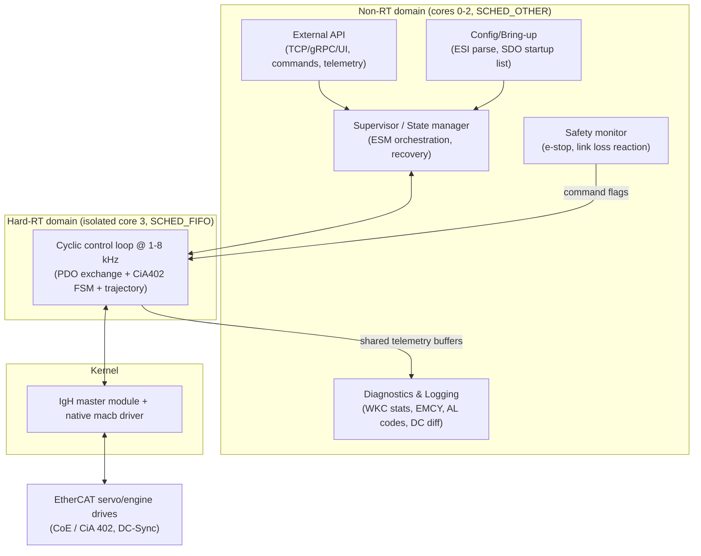

# 10 — Proposed Architecture for OUR Master Application

This ties the theory to a concrete, deterministic design for the MPSoC + Linux + IgH +
CiA 402 drives system. It's a blueprint, not final code — we refine it as we implement.

## 1. High-level component diagram



## 2. Threads and priorities

| Thread | Core | Sched | Priority | Job |
|--------|------|-------|----------|-----|
| RT cyclic loop | 3 (isolated) | SCHED_FIFO | 80 | receive→process→control→send, DC sync |
| Supervisor/FSM orchestration | 0–2 | SCHED_OTHER/FIFO low | — | ESM transitions, recovery, SDO requests staging |
| Diagnostics/logging | 0–2 | SCHED_OTHER | — | drain telemetry ring buffers, persist |
| External API/UI | 0–2 | SCHED_OTHER | — | accept setpoints/commands, publish state |
| Safety monitor | 0–2 (or RT) | high | — | e-stop, watchdog, link-loss → set safe flags |

RT↔non-RT data exchange: **lock-free** (triple buffer for state snapshots; SPSC ring for
commands/events). The RT loop **never** takes a lock held by non-RT code and does **no**
syscalls except the timer sleep and `ecrt_master_send/receive`.

## 3. The cyclic loop (pseudocode)

```c
void rt_loop(void) {
  struct timespec next;
  clock_gettime(CLOCK_MONOTONIC, &next);
  add_ns(&next, PERIOD_NS);

  for (;;) {
    clock_nanosleep(CLOCK_MONOTONIC, TIMER_ABSTIME, &next, NULL);

    ecrt_master_receive(master);
    ecrt_domain_process(domain);

    ec_domain_state_t ds; ecrt_domain_state(domain, &ds);
    bool data_ok = (ds.wc_state == EC_WC_COMPLETE);

    // pull latest commands from non-RT (setpoints, mode, e-stop) via lock-free buffer
    cmd_t cmd = cmd_buffer_read();

    for (int i = 0; i < n_axes; i++) {
      uint16_t status = EC_READ_U16(pd + ax[i].off_status);
      int32_t  actpos = EC_READ_S32(pd + ax[i].off_actpos);

      uint16_t ctrl; int32_t tgt;
      if (!data_ok || cmd.estop || safety_tripped()) {
        drive_safe_stop(&ax[i], status, &ctrl, &tgt);   // quick stop / disable
      } else {
        cia402_fsm_step(&ax[i], status, &ctrl);         // 0x06->0x07->0x0F
        tgt = trajectory_step(&ax[i], actpos, &cmd);    // CSP setpoint
        if (!ax[i].enabled) tgt = actpos;               // hold to avoid jump
      }
      EC_WRITE_U16(pd + ax[i].off_ctrl,   ctrl);
      EC_WRITE_S32(pd + ax[i].off_tgtpos, tgt);

      telemetry_publish(i, status, actpos);             // to non-RT ring buffer
    }

    // Distributed clocks discipline
    app_time += PERIOD_NS;
    ecrt_master_application_time(master, base_time + app_time);
    ecrt_master_sync_reference_clock(master);
    ecrt_master_sync_slave_clocks(master);

    ecrt_domain_queue(domain);
    ecrt_master_send(master);

    add_ns(&next, PERIOD_NS);   // absolute next deadline (optionally PI-corrected to DC)
  }
}
```

## 4. Startup / commissioning sequence (supervisor)

```mermaid
sequenceDiagram
  participant S as Supervisor (non-RT)
  participant M as IgH master
  participant D as Drives (ESM + CiA402)

  S->>M: request_master, create_domain, slave_config(...)
  S->>M: config PDOs (0x1600/0x1A00, 0x1C12/0x1C13)
  S->>M: config SDO startup (mode=CSP, limits, scaling)
  S->>M: config DC (SYNC0 = cycle)
  S->>M: ecrt_master_activate()
  Note over M,D: ESM: INIT -> PREOP -> SAFEOP
  S->>M: start RT loop (cyclic frames)
  M->>D: cyclic PDOs; verify WKC + DC lock (N cycles)
  Note over M,D: ESM: SAFEOP -> OP
  loop each cycle (RT)
    M->>D: seed target=actual, run 0x06->0x07->0x0F
    D-->>M: statusword -> Operation Enabled
  end
  S->>S: axes enabled -> accept motion commands
```

## 5. Per-axis data model

```c
typedef struct {
  // identity / config
  uint16_t alias, position;
  uint32_t vendor_id, product_code;
  int8_t   mode;                 // 8=CSP, 9=CSV, 10=CST
  // process-image offsets (filled at activate)
  unsigned off_ctrl, off_status, off_tgtpos, off_actpos, off_modes, off_modedisp;
  // runtime
  uint16_t last_status;
  int32_t  actual_pos, target_pos;
  bool     enabled, faulted;
  // scaling (from ESI/manual)
  double   counts_per_unit;
  int32_t  pos_min, pos_max, max_torque;
} axis_t;
```

## 6. Safety reactions (must-have)

| Event | Detection | Reaction |
|-------|-----------|----------|
| WKC incomplete | `wc_state != EC_WC_COMPLETE` | Hold/quick-stop; count; if persistent → disable + alarm |
| Slave left OP | periodic BRD AL status | quick-stop affected axis; attempt re-init |
| Drive fault | statusword bit3 | log 0x603F/EMCY; controlled stop; require operator reset |
| DC unlocked | 0x092C rising / not converged | don't allow OP / motion; re-sync |
| E-stop / link loss | GPIO / NIC link | disable voltage; SM watchdog is backstop |
| RT loop overrun | deadline missed | log; if repeated → safe shutdown via WDT |

## 7. Configuration data (keep out of code)

- A **machine config** file (YAML/JSON/TOML) listing axes: alias/position, vendor/product,
  mode, PDO map choice, scaling, limits, SYNC0 shift. The supervisor reads it and programs
  the master. This makes adding/removing drives a config change, not a recompile.
- Store verified per-drive facts (assign_activate for DC, fixed vs configurable PDOs,
  units/scaling) alongside, sourced from each drive's ESI/manual.

## 8. Suggested repo layout (to create when we start coding)

```
ethercat_proj/
  docs/ethercat/            # <-- this knowledge base
  config/machine.yaml       # axes & scaling
  src/
    main.c                  # init, thread setup, mlockall, affinity
    rt_loop.c/.h            # cyclic loop
    cia402.c/.h             # drive FSM + mode helpers
    trajectory.c/.h         # setpoint generation
    master_setup.c/.h       # IgH config (PDOs, SDOs, DC, domains)
    supervisor.c/.h         # ESM orchestration + recovery
    safety.c/.h             # reactions, watchdog
    ipc.c/.h                # lock-free RT<->non-RT buffers
    diag.c/.h               # logging, telemetry
  scripts/                  # rt tuning, isolcpus, cyclictest helpers
```

## 9. Definition of done for stage 1

- PREEMPT_RT tuned; `cyclictest` worst-case ≪ cycle.
- One axis reaches **Operation Enabled** in **CSP**, DC-locked, WKC complete, and follows a
  simple trajectory smoothly.
- Clean shutdown and safe-stop on fault/e-stop/link-loss.
- Then generalize to N axes from `machine.yaml`.

See [11-glossary-and-references.md](11-glossary-and-references.md) for terms and sources.
